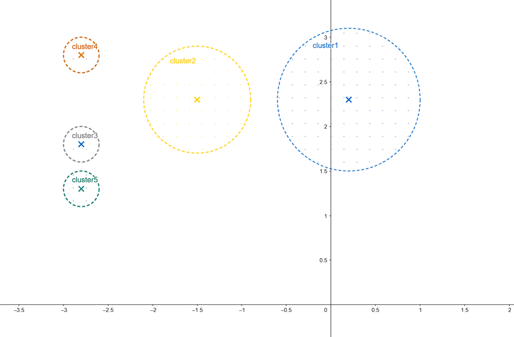
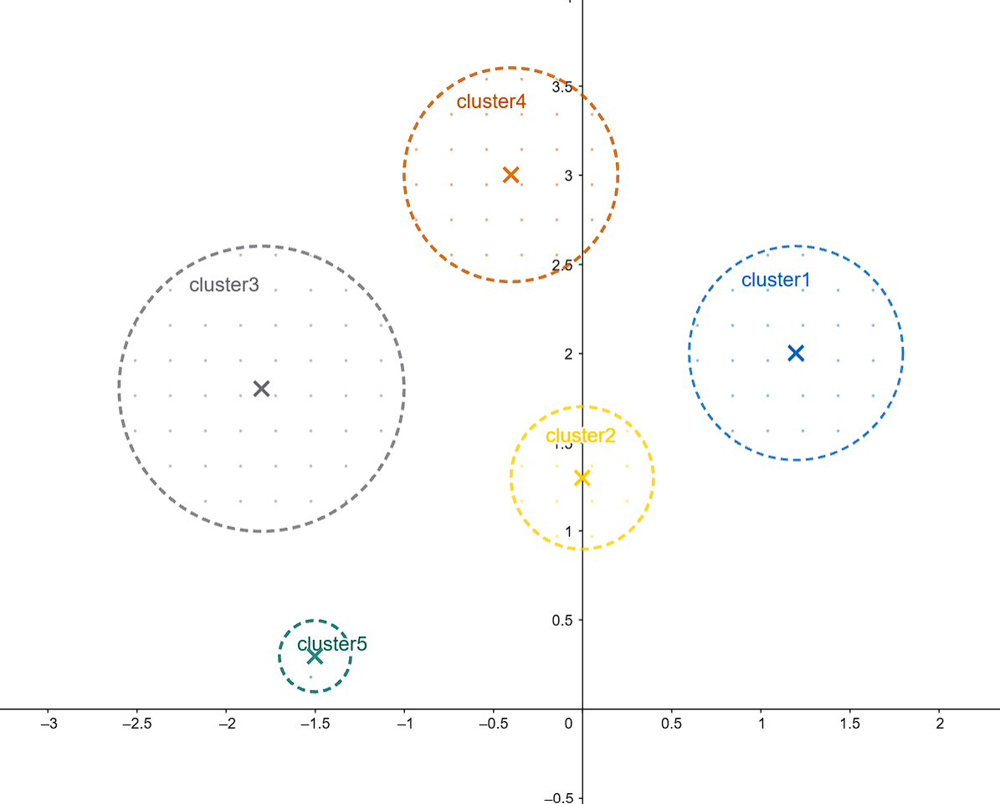
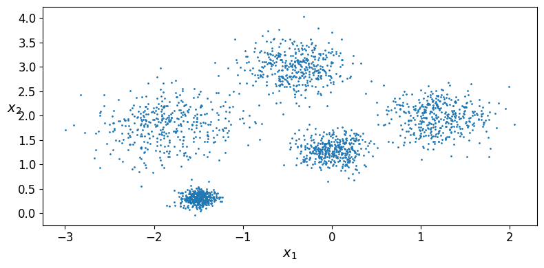
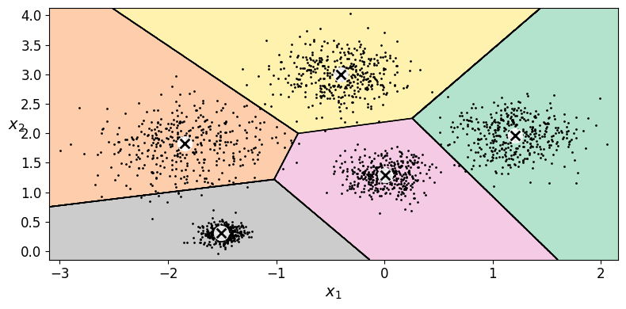
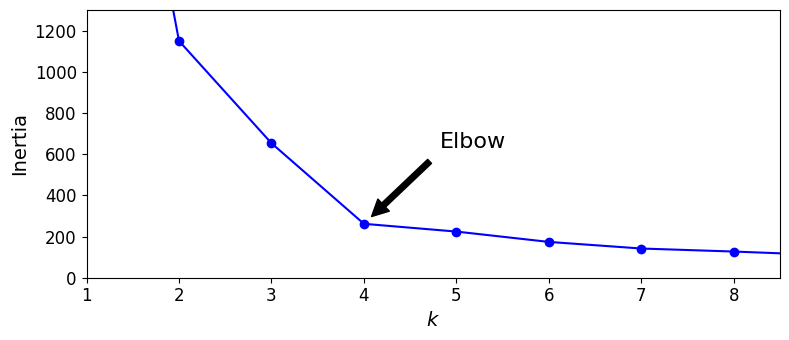
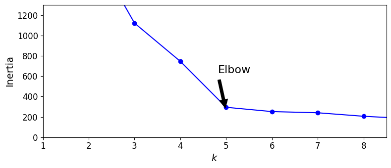
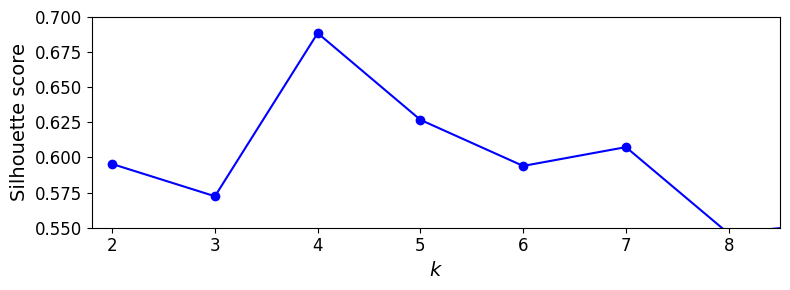
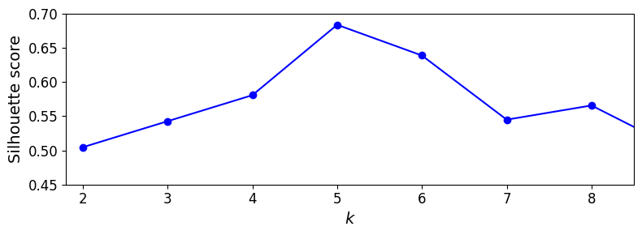
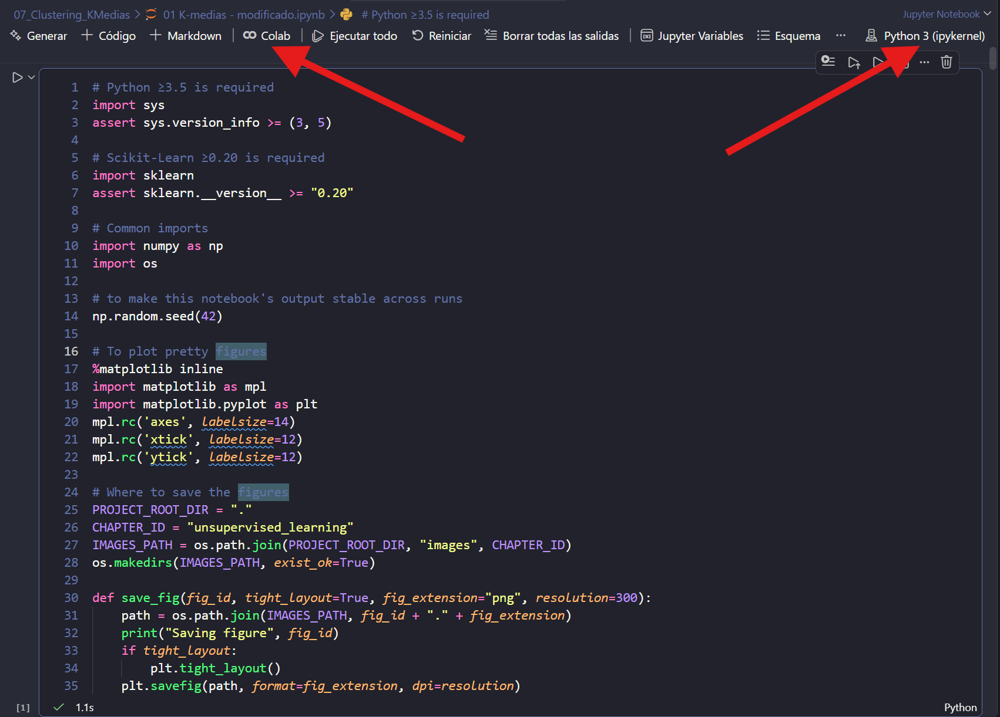

# Ejercicio 1 — Separar los blobs y volver a elegir (k)

## Autor

**Aarón Eduardo Arceo Arjona**

Para este ejercicio se propuso la siguiente distribución de centroides.

```python
# Blob centers modificado
blob_centers = np.array(
    [[ 1.2,  2.0],
     [0 ,  1.3],
     [-1.8,  1.8],
     [-0.4,  3],
     [-1.5,  0.3]])
blob_std = np.array([0.3, 0.2, 0.4, 0.3, 0.1])
```

Es decir:

- Centroide_1 = (1.2, 2.0) con `blob_std` = 0.3
- Centroide_2 = (0 , 1.3) con `blob_std` = 0.2
- Centroide_3 = (-1.8, 1.8) con `blob_std` = 0.4
- Centroide_4 = (-0.4, 3) con `blob_std` = 0.3
- Centroide_5 = (-1.5, 0.3) con `blob_std` = 0.1

Así se queda:

<table>
  <tr>
    <th style="border-right: 1px solid gray;">Original</th>
    <th>Modificado</th>
  </tr>
  <tr>
    <td style="border-right: 1px solid gray;"></td>
    <td></td>
  </tr>
</table>

Con esos centros se generaron los 2000 puntos (`n_samples=2000`, `random_state=7`). El siguiente scatter muestra los blobs originales y los modificados; en el modificado ya se distinguen a simple vista las 5 nubes, mientras que en el original tres de ellas (izquierda) están casi pegadas:

<table>
  <tr>
    <th style="border-right: 1px solid gray;">Original</th>
    <th>Modificado</th>
  </tr>
  <tr>
    <td style="border-right: 1px solid gray;"></td>
    <td></td>
  </tr>
</table>

Con ayuda de la distribución de centroides original y la modificada se construyeron graficos de voronoi tal y como se muestra en las siguientes imágenes.

<table>
  <tr>
    <th style="border-right: 1px solid gray;">Original</th>
    <th>Modificado</th>
  </tr>
  <tr>
    <td style="border-right: 1px solid gray;"></td>
    <td></td>
  </tr>
</table>

De las imágenes anteriores se puede observar que la gráfica de voronoi con el conjunto de datos originales dividió un centroide en dos grupos que debía conservarse como uno y agrupó dos conjuntos que visualmente son completamente diferentes. Por otra parte, el dataset modificado sí obtuvo gráficos de voronoi más marcados, con 5 grupos que tienen centroides más cercanos a los propuestos.

Las gráficas de inercia de cada conjunto de datos sugieren una agrupación óptima de k = 4 para la propuesta original y k = 5 para los centroides modificados.

<table>
  <tr>
    <th style="border-right: 1px solid gray;">Original</th>
    <th>Modificado</th>
  </tr>
  <tr>
    <td style="border-right: 1px solid gray;"></td>
    <td></td>
  </tr>
</table>

Finalmente con ayuda la gráfica de la silueta se puede observar que tanto el score de silueta del original y el modificado coincidieron con el valor de k obtenido mediante el método del codo. Con los centroides modificados, se obtuvo un score de silueta de 0.68, superando los 0.58 con una agrupación de k = 4 con el mismo conjunto de datos.

<table>
  <tr>
    <th style="border-right: 1px solid gray;">Original</th>
    <th>Modificado</th>
  </tr>
  <tr>
    <td style="border-right: 1px solid gray;"></td>
    <td></td>
  </tr>
</table>

## Conclusiones

**¿Por qué el codo "prefiere" k = 4 en los datos de Géron si `make_blobs` usó 5 centros?**

Porque los tres centroides de la izquierda están casi pegados, así que k-means los trata como una sola nube grande cuando k es pequeño. Esto se ve en las inercias, de k = 3 a k = 4 la inercia cae de 653 a ~270, pero de k = 4 a k = 5 solo baja de ~270 a 224. Como agregar el quinto cluster casi no reduce la inercia, el codo se marca visualmente en k = 4 y no en k = 5, aunque en realidad sí hay 5 centros.

**Con los blobs separados, ¿el codo y la silueta coinciden en el mismo k? ¿Ese k es 5?**

Sí. Al alejar los tres centros de la izquierda y subir el `blob_std` del más disperso a 0.4, la caída de inercia grande ahora ocurre entre k = 4 y k = 5 (de ~740 a 294.19) y no entre k = 5 y k = 6 (de 294.19 a ~256), por lo que el codo se mueve a k = 5. La silueta coincide: alcanza su máximo en k = 5 (0.68) y baja en k = 4 (0.58), la misma tendencia que muestra la gráfica de silueta modificada. Ambos resultados sugieren un k = 5.

**Si el codo se hubiera quedado en 4, ¿qué faltaría mover: distancia entre centros o `blob_std`?**

En este caso no aplica porque el codo sí se movió a k = 5, pero si se hubiera quedado en 4 la señal habría sido que algún par de centros seguía muy cercano. En ese escenario no basta con bajar `blob_std`, si los centros siguen muy cerca, aunque se reduzca la desviación estándar las nubes pueden seguir solapándose lo suficiente para que k-means las agrupe en una. Lo más efectivo es ver la correcta separación entre los centros y, si aun así se ven pegados, complementar bajando `blob_std`.

Finalmente adjunto la evidencia de que se ejecutó el código en colab desde vscode.


